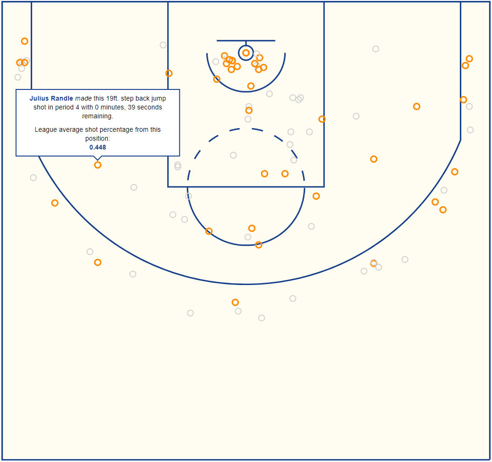

# shotmaps

This repo houses a project to create interactive shot maps of NBA games in D3. It features a couple R scripts to query position data of field goal attempts from the NBA stats website from any given game.

The work takes inspiration from Owen Phillips' blogpost on accessing NBA data for shot charts in R:
https://www.owenlhjphillips.com/new-blog/2020/6/25/how-to-make-nba-shots-charts-in-r

It utilizes the output of the {ballr} package to plot the outline of the NBA court:
https://github.com/toddwschneider/ballr

# D3 script

The final output of the creation is an interactive D3 plot to show all shots of a given game. The example created is for a recent 5/9/21 game showing the Knicks FGA against the Clippers.

A link to an example shot D3 visualization with interactions is here:
https://willdebras.github.io/shotmaps/

